# Synology에서 docker-tvheadend 실행 방법

이 문서는 Synology DSM에서 docker-tvheadend를 실행하는 방법을 설명한다. 작성 시점이 오래 되어 상세 내용은 조금 다를 수 있으니 [README](https://github.com/wiserain/docker-tvheadend/blob/epgkr/README.md)의 내용을 우선으로 한다.

### DSM의 GUI를 이용하는 방법


1\. 패키지 센터로 가서 Docker를 설치한다.
<br>

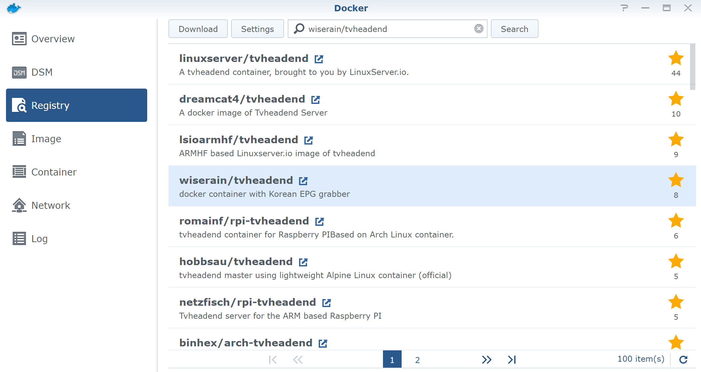

2\. 왼쪽 Registry에서
<br>

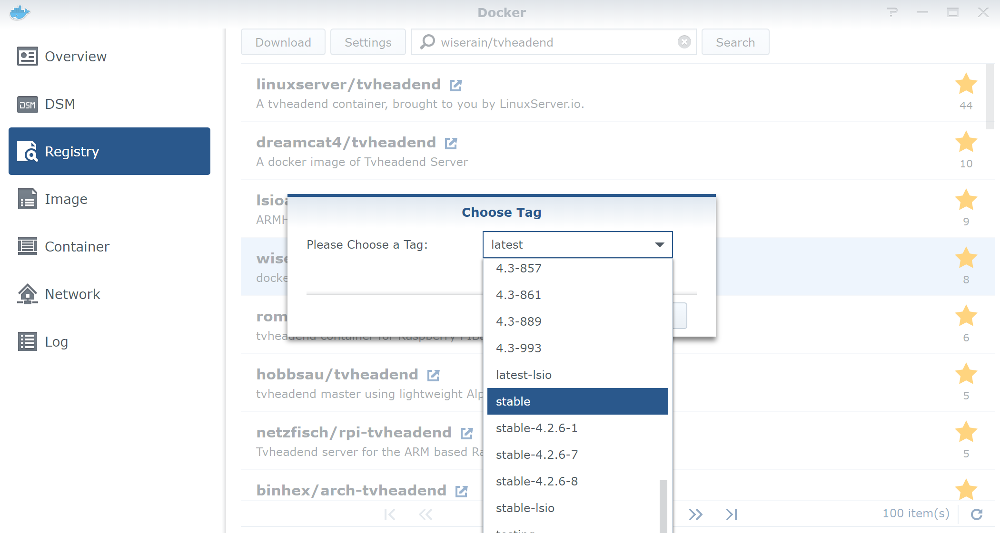

3\. ```wiserain/tvheadend```를 검색하여 다운로드 한다. latest는 [새로운 기능](https://tvheadend.org/projects/tvheadend/roadmap)을 체험할 수 있는 개발 버전으로 약간 불안정할 수 있으니 stable tag 사용을 권한다. 드롭 다운 메뉴를 펼쳐 보면 과거 이미지 버전이 있으니 필요할 경우 예전 버전으로 돌아가는 것도 가능하다.
<br>

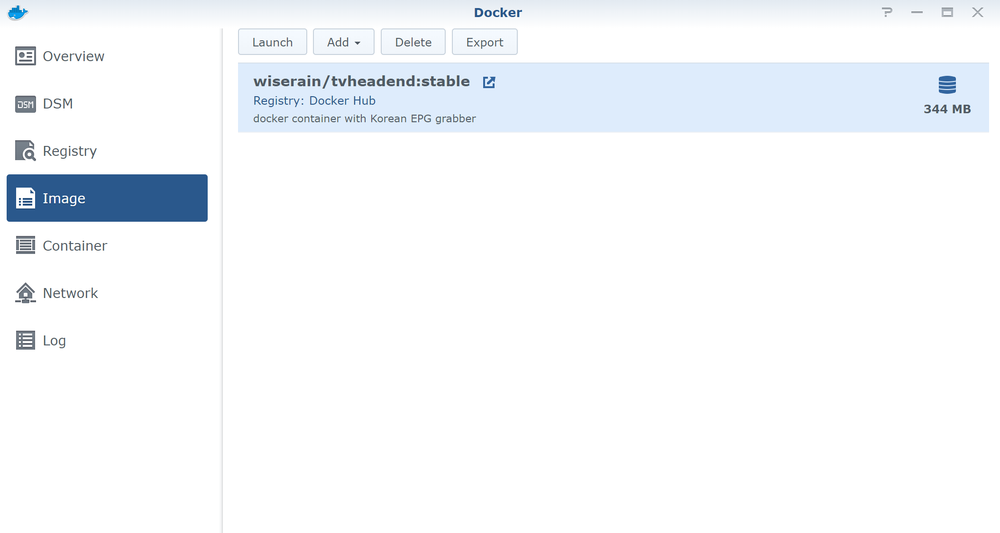

4\. 다운로드가 완료되면 Image 섹션에 나타난다. 이제 이 이미지를 활용해서 tvheadend 앱이 돌아가는 가상의 시스템 공간인 Container를 만든다. 이미지를 선택하고 Launch를 누르면
<br>

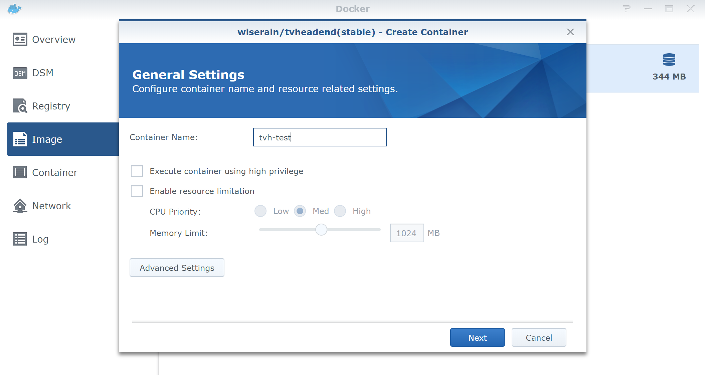

5\. Container의 세부 내용을 설정할 수 있다. 먼저 이름을 적당히 정하고, Advanced Settings를 눌러서 상세 설정을 한다.
<br>

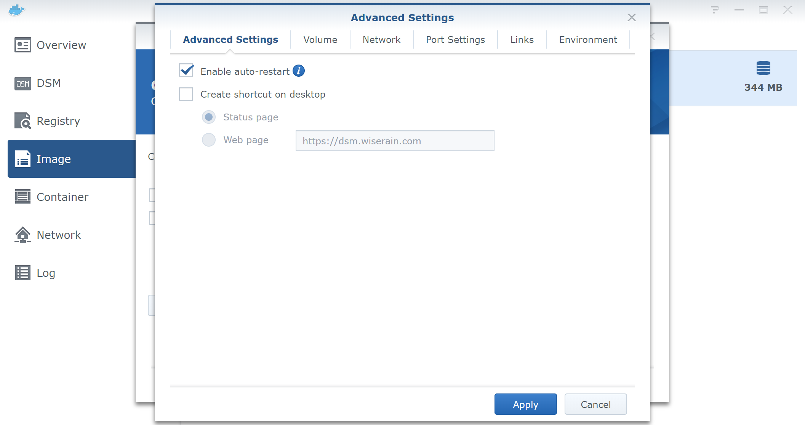

6\. 시놀로지가 껐다 켜져도 자동으로 실행하도록 해야하니 Enable auto-restart에 체크한다.
<br>

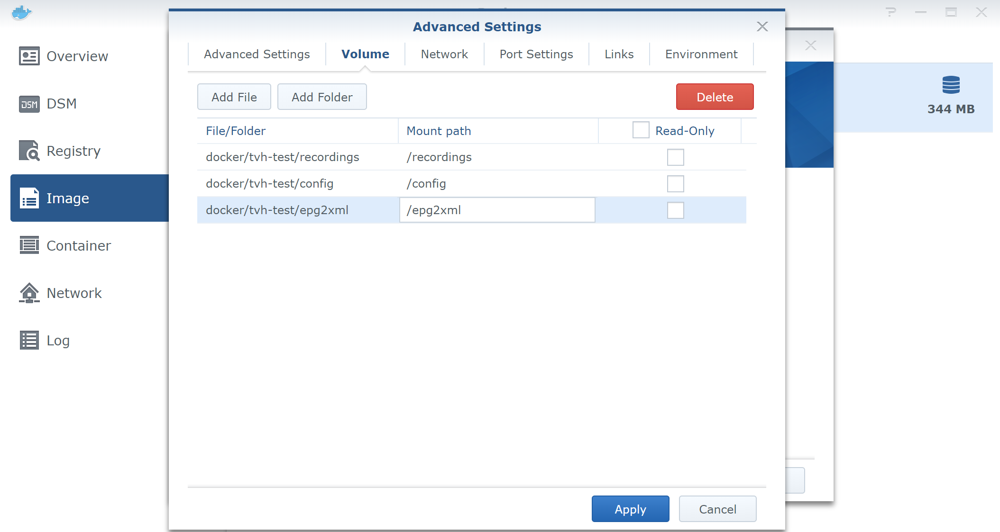

7\. 컨테이너 내부의 공간(Mount path)과 실제 우리가 사용하는 공간을 서로 링크해준다. ```/config```는 tvheadend의 모든 설정이 저장되는 곳이며, ```/recordings```의 경우는 녹화하게 될 경우를 위한 template 폴더이다. 마지막으로 ```/epg2xml```은 epg2xml 스크립트와 사용자 설정을 저장하는 공간이다. 이런 식으로 원하는 경로를 마운트하고 docker container에서 가져다 쓰면 된다.
<br>

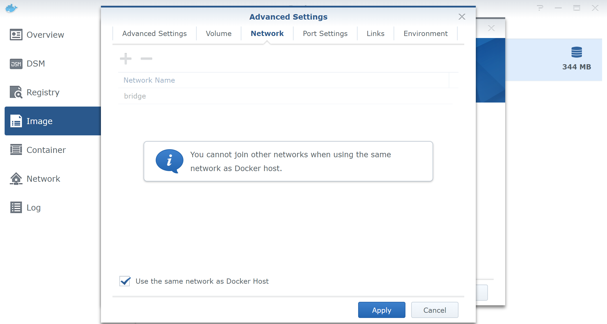

8\. 네트워크는 호스트와 동일 네트워크 사용에 체크. [README](https://github.com/wiserain/docker-tvheadend/blob/epgkr/README.md)에서도 언급했지만, docker는 멀티캐스트 패킷 라우팅이 안되기 때문에 tvheadend는 **무조건 hosted network** 를 사용해야 한다. 일부 낮은 버전에서는 지원하지 않으니 참고. (예를 들면 DSM 5.2)
<br>

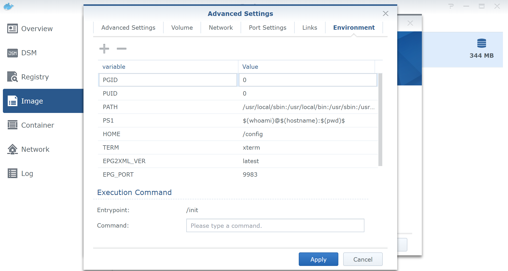

9\. 이제 환경변수를 입력해준다. 이 변수들은 그대로 가상 시스템에 전달되어 활용 되는데, 여기서는 필수 항목만 설명하니 추가로 사용 가능한 옵션들은 [README](https://github.com/wiserain/docker-tvheadend/blob/epgkr/README.md)에서 확인하길 바란다. ```PGID``` 와 ```PUID``` 는 컨테이너 내부의 앱이 외부의 볼륨에 접근할 수 있도록 하는 권한에 대한 것이다. [여기](https://github.com/linuxserver/docker-tvheadend#user--group-identifiers) 중간쯤에 잘 설명되어 있는데, 시놀로지에서는 docker가 root 권한으로 동작하므로 속편하게 둘 다 0으로 입력해 준다. (물론 보안상 추천하는 방법은 아니다)

기본으로 입력된 변수가 노출되어 그대로 보이는데, 무시하고 ```PUID```와 ```PGID``` 두 개만 설정해 준다. 나머지는 적절한 실행을 위해 미리 입력해둔 값이므로 모르면 수정하거나 삭제하지 않는다. 실행 명령도 마찬가지로 그대로 둔다.
<br>


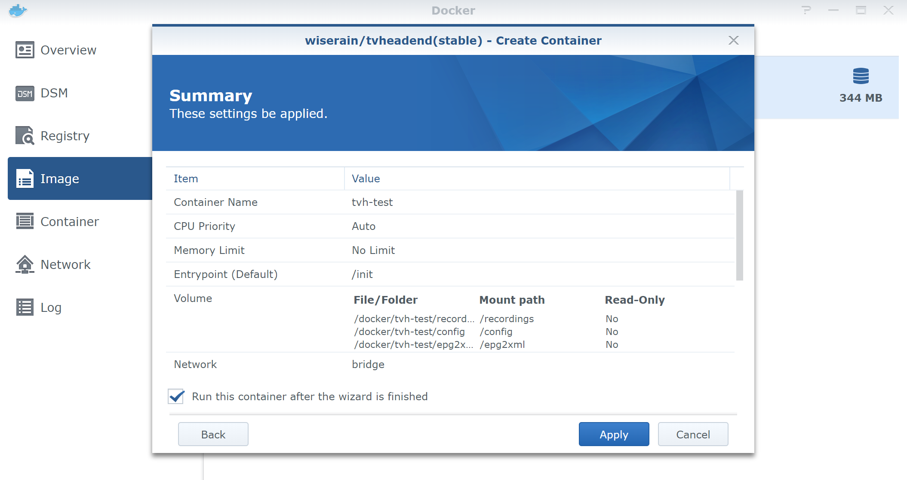

10\. Apply를 누르면 마지막으로 설정 내용을 다시 한번 확인하고 create와 동시에 run하도록 체크를 해준다. (원하면 따로도 가능)
<br>

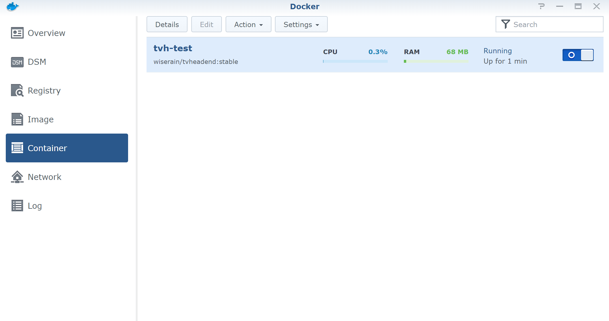

11\. 이제 Container 섹션을 보면 만들어져 실행되고 있는 것을 확인할 수 있다. 여기서 켜고 끄고 지우고 등등 할 수 있다.
<br>

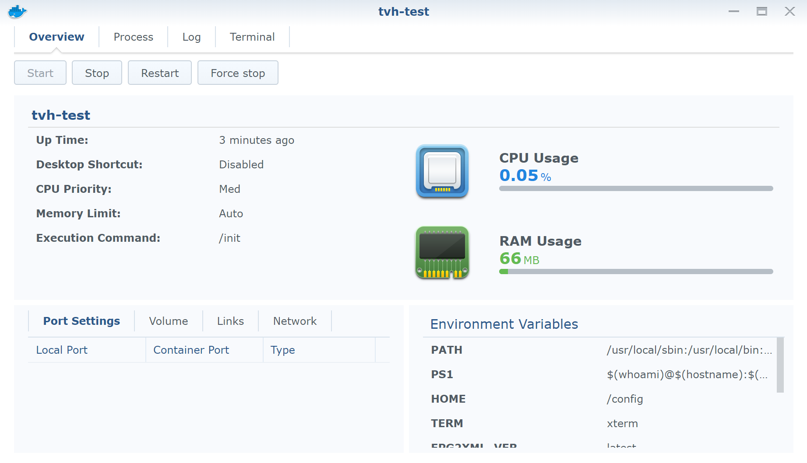

12\. 선택 후 Detail을 누르면 동작하고 있는 정보를 볼 수 있고,
<br>

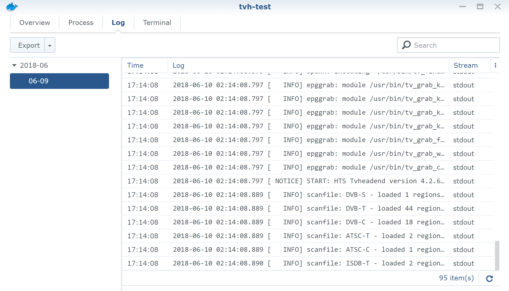

13\. Log 탭에 보면 처음 기동 후의 초기화 작업이 진행 중인 것을 알 수 있다.
<br>

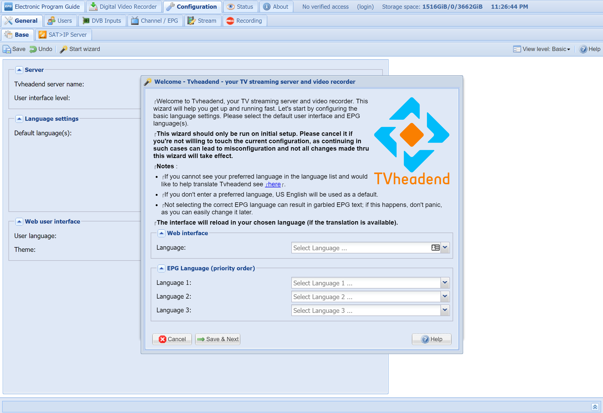

14\. 완료 후 <http://localhost:9981>로 접속하면 tvheadend 초기 설정 메뉴가 보인다.
<br>

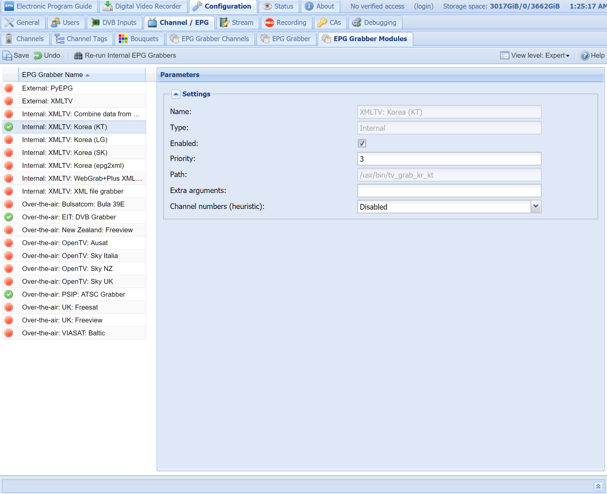

15\. EPG Grabber Modules를 보면 미리 마련해둔 KT LG SK 3사의 Interal XMLTV grabber가 있으니 각자의 iptv 회사에 맞게 켜서 사용하면 된다. ```Korea (epg2xml)```은 extra arguments를 받는 범용 grabber이니 잘 아는 경우에만 쓴다. 마지막으로 사용하지 않는 grabber는 꺼준다.
<br>

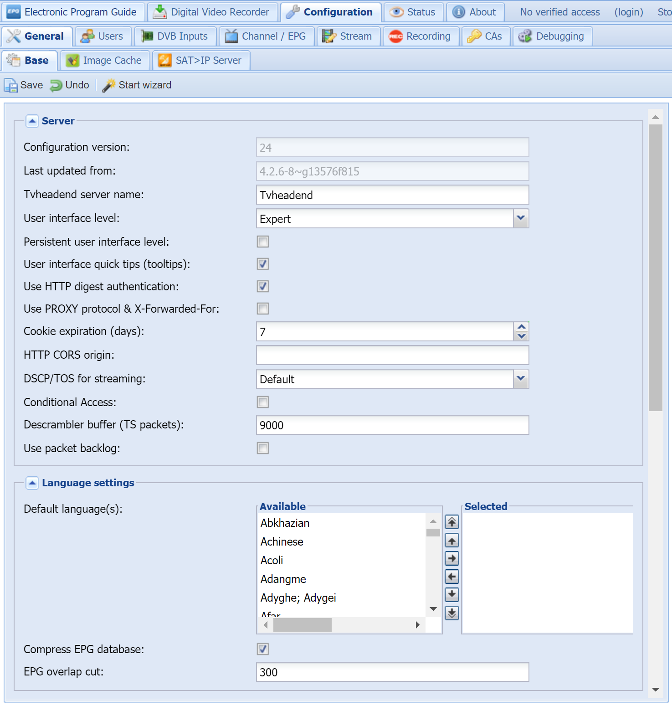

16\. 혹시 EPG Grabber Modules이 보이지 않으면 설정에서 User interface level을 Expert로 해주면 된다.
<br>

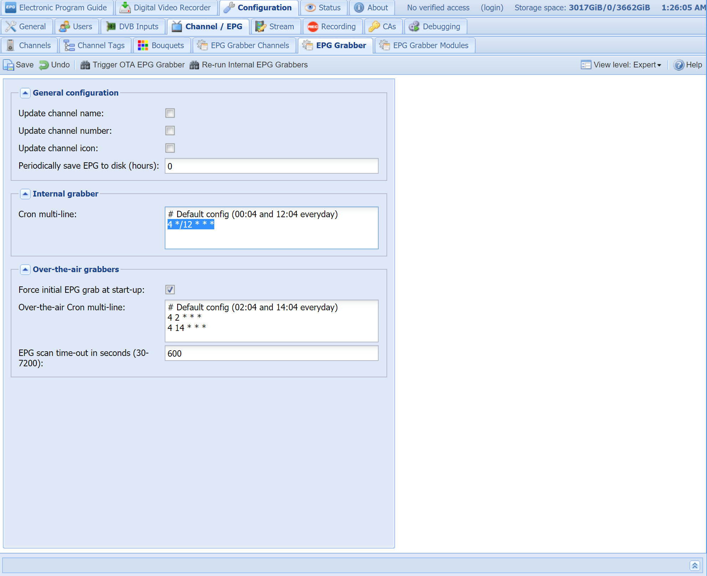

17\. 이제 EPG Grabber 탭으로 와서 얼마나 자주 epg2xml을 실행해서 가져올지 Cron 설정을 해준다. **기본값으로 쓰지 말고** 분단위라도 랜덤하게 변경해서 트래픽을 분산시키도록 하자.
<br>

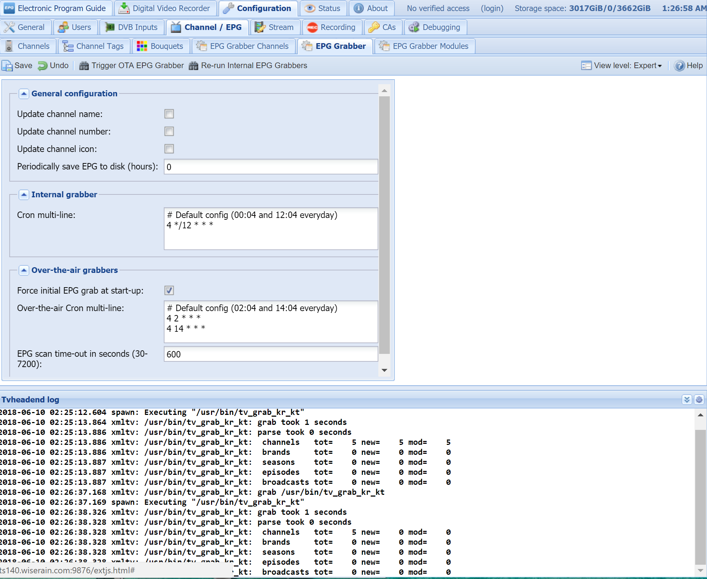

18\. 이제 Re-run Internal EPG Grabbers 버튼을 눌러 EPG를 가져와 보자. 아래 로그 창을 보면 5개 채널을 성공적으로 가져온 것을 알 수 있다. 다른 채널을 추가로 가져오고 싶다면 ```epg2xml.json``` 파일을 수정해 준다.
<br>


### docker-compose를 이용하는 방법

putty등의 프로그램을 이용해 ssh로 접속한다. docker는 기본적으로 root로 동작하므로 root 권한을 획득하고,

```bash
sudo -i
```

접속하여 docker 경로로 이동한다. (시스템마다 다를 수 있음)

```bash
cd /volume1/docker
```
docker-compose.yml 파일을 생성한다. (이미 있으면 적절히 편집)

```bash
vi docker-compose.yml
```

아래 내용을 붙여 넣는다. yml 문법을 따르므로 띄어쓰기와 indent에 주의한다.

```yml
version: '2'

services:
  tvh-test:
    container_name: tvh-test
    image: wiserain/tvheadend:latest
    restart: always
    network_mode: "host"
    volumes:
      - /volume1/docker/tvh-test/config:/config
      - /volume1/docker/tvh-test/recordings:/recordings
      - /volume1/docker/tvh-test/epg2xml:/epg2xml
    environment:
      - PUID=0
      - PGID=0
```

이 내용은 앞에서 DSM GUI로 설정했던 컨테이너의 설정을 그대로 반영한다. 자신의 환경에 맞게 volumes나 container_name 등을 수정하여 사용하도록 한다. 나중에 다른 이미지로부터의 컨테이너가 있으면 services 아래에 추가하면 된다. 저장하고 나와서 아래 명령어를 치면 컨테이너를 생성하고 실행한다.

```
docker-compose up -d <service name e.g. tvh-test>
```

이후 과정은 동일하게 웹 <http://localhost:9981/> 에서 진행한다.

### 자주 묻는 질문

[문제가 발생하면 읽어보세요.](https://github.com/wiserain/docker-tvheadend/blob/epgkr/assets/faqs.md)
